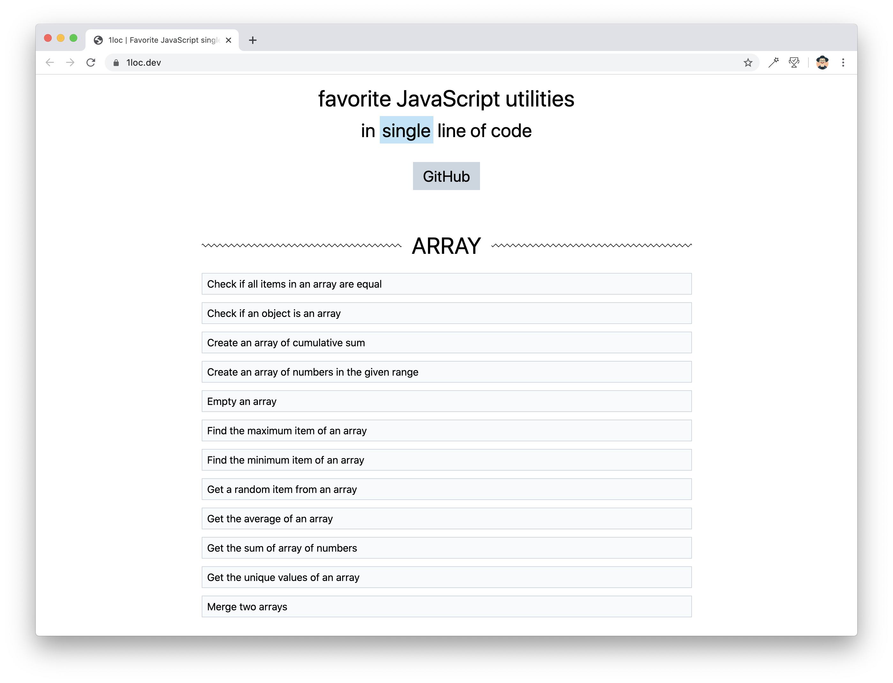

# Favorite single line of code

What's your favorite JavaScript single LOC (line of code)? Let me know!

## Running it on local

1. Clone the project:

~~~ console
$ git clone https://github.com/phuoc-ng/1loc
~~~

2. Install the dependencies:

~~~ console
$ cd 1loc
$ npm install
~~~

3. Run it on the local:

~~~
$ npm run dev-server
~~~

Open http://localhost:1234 in your browser to see it in action.

## Contributing

Pull requests are welcomed. To submit your favorite JavaScript single line of code, please create a markdown file, and put it in 
a particular category of the [collections](collections) folder.

## About

This project is developed by _Nguyen Huu Phuoc_. I love building products and sharing knowledge.

Be my friend on
* [Twitter](https://twitter.com/nghuuphuoc)
* [dev.to](https://dev.to/phuocng)
* [Github](https://github.com/phuoc-ng)

## Products

You might be interested in my products:

<table>
    <tbody>
        <tr valign="top">
            <td width="25%" align="center">
                <h3>1 LOC (3k★)</h3>
                <a href="https://1loc.dev">Favorite JavaScript utilities in single line of code</a>
            </td>
            <td width="25%" align="center">
                <h3>Blur Page</h3>
                <a href="https://blur.page">A browser extension to hide sensitive information on a web page</a>
            </td>
            <td width="25%" align="center">
                <h3>CSS Layout (2.4k★)</h3>
                <a href="https://csslayout.io">A collection of popular layouts and patterns made with CSS</a>
            </td>
            <td width="25%" align="center">
                <h3>Fake Numbers</h3>
                <a href="https://fakenumbers.io">Generate fake and valid numbers</a>
            </td>
        </tr>
        <tr valign="top">
            <td width="25%" align="center">
                <h3>Form Validation</h3>
                <a href="https://formvalidation.io">The best validation library for JavaScript</a>
            </td>
            <td width="25%" align="center">
                <h3>HTML DOM (2.9k★)</h3>
                <a href="https://htmldom.dev">How to manage HTML DOM with vanilla JavaScript</a>
            </td>
            <td width="25%" align="center">
                <h3>React PDF Viewer</h3>
                <a href="https://react-pdf-viewer.dev">A React component to view a PDF document</a>
            </td>
            <td width="25%" align="center">
                <h3>this VS that</h3>
                <a href="https://thisthat.dev">The differences between ___ and ___ in the front-end development</a>
            </td>
        </tr>
    </tbody>
</table>
